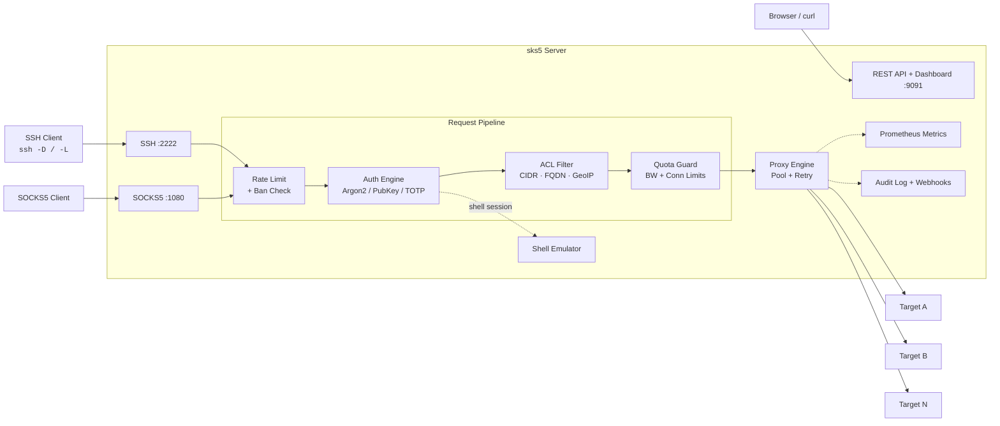

# sks5

[](https://github.com/galti3r/sks5/actions/workflows/ci.yml) [](https://codecov.io/gh/galti3r/sks5) [](https://deps.rs/repo/github/galti3r/sks5) [](https://crates.io/crates/sks5) [](LICENSE)
[](https://docs.rs/sks5) [](https://hub.docker.com/r/dockerhubgalti3r/sks5) [](https://github.com/galti3r/homebrew-sks5) [](https://github.com/galti3r/sks5/releases/latest) [](https://blog.rust-lang.org/)

> Lightweight Alpine-based Docker images. Rootless by default. Single static binary. Multi-user auth. Real-time dashboard.

<p align="center">
  
</p>

> Generated with [VHS](https://github.com/charmbracelet/vhs) from [`contrib/demo.tape`](contrib/demo.tape). Regenerate locally: `vhs contrib/demo.tape`



## Dashboard

| Dark Theme | Light Theme |
|:---:|:---:|
|  |  |

## Feature Highlights

| Category | Features |
|----------|----------|
| :satellite: SSH & Proxy | SSH dynamic forwarding (`-D`), local forwarding (`-L`), standalone SOCKS5, TLS SOCKS5, UDP relay (SOCKS5 UDP ASSOCIATE), connection pooling, smart retry with exponential backoff |
| :lock: Authentication | Argon2id passwords, SSH public keys, SSH certificates, TOTP 2FA, auth method chaining |
| :shield: Access Control | Per-user and global ACL, CIDR/FQDN wildcards, GeoIP country filtering, anti-SSRF guard, time-based access windows, account expiration |
| :no_entry: Security | Auto-ban (fail2ban-style), IP reputation scoring, pre-auth rate limiting, SFTP/SCP blocked, password zeroization, webhook SSRF protection |
| :computer: Shell | Virtual filesystem, `show` commands (status, bandwidth, connections, ACL, fingerprint, history), `test`/`ping`/`resolve`, bookmarks, aliases, tab completion, MOTD |
| :bar_chart: Observability | Prometheus metrics, structured audit logs, webhooks with HMAC (Slack/Discord/custom formats), alerting rules, real-time web dashboard with SSE |
| :wrench: Management | REST API, hot config reload, maintenance mode/windows, user groups and roles, quotas (bandwidth + connections), broadcast/kick |
| :whale: Container | Alpine image (~12 MB, default), `scratch` variant (~5 MB), rootless, static musl binary, multi-arch (amd64/arm64) |
| :rocket: Deployment | Docker, Podman, Kubernetes, bare metal, single static binary, `cargo install` |

## Install

### Docker / Podman (recommended)

sks5 ships as a **~12 MB Alpine image** with shell access for easy debugging. A minimal scratch variant is also available.

```bash
# Docker
docker run -p 2222:2222 ghcr.io/galti3r/sks5:latest quick-start --password demo

# Podman (rootless)
podman run -p 2222:2222 ghcr.io/galti3r/sks5:latest quick-start --password demo
```

Available on both `ghcr.io/galti3r/sks5` and `dockerhubgalti3r/sks5`:

| Tag | Base | Size | Shell | Use case |
|-----|------|------|-------|----------|
| `latest` / `0.x.x` | Alpine 3.22 | ~12 MB | Yes | Production (default) |
| `latest-alpine` / `0.x.x-alpine` | Alpine 3.22 | ~12 MB | Yes | Alias for `latest` |
| `latest-scratch` / `0.x.x-scratch` | scratch | ~5 MB | No | Minimal attack surface |

### Cargo

```bash
cargo install sks5
```

### Homebrew (macOS/Linux)

```bash
brew tap galti3r/sks5
brew install sks5
```

### Binary (GitHub Releases)

Download pre-built static binaries from [Releases](https://github.com/galti3r/sks5/releases/latest):
- `sks5-x86_64-linux-gnu.tar.gz`
- `sks5-x86_64-linux-musl.tar.gz` (static)
- `sks5-aarch64-linux-gnu.tar.gz`
- `sks5-aarch64-linux-musl.tar.gz` (static)

## Quick Start

### Zero config

```bash
# Auto-generated password
sks5 quick-start

# With a chosen password
sks5 quick-start --password demo

# With standalone SOCKS5 listener
sks5 quick-start --password demo --socks5-listen 0.0.0.0:1080

# Save generated config for later
sks5 quick-start --password demo --save-config config.toml
```

### Interactive Wizard

```bash
sks5 wizard
```

Full-screen interactive wizard with 14 configuration sections (Server, Users, ACL, Security, Logging, Quotas, etc.). Navigate with arrow keys, configure all options, then save and validate.

<p align="center">
  
</p>

> Generated with [VHS](https://github.com/charmbracelet/vhs) from [`contrib/wizard.tape`](contrib/wizard.tape). Regenerate locally: `vhs contrib/wizard.tape`

For non-interactive use: `sks5 wizard --non-interactive --output config.toml`

### Generate a config file

```bash
# Interactive (prompts for password)
sks5 init

# Non-interactive
sks5 init --username alice --password secret --output config.toml
```

### Manual setup

```bash
make build
cp config.example.toml config.toml
sks5 hash-password --password "your-password"
# Edit config.toml with the generated hash
make run
```

### Connect

```bash
# SSH shell
ssh -o StrictHostKeyChecking=no alice@localhost -p 2222

# Dynamic forwarding (SOCKS5 via SSH)
ssh -D 1080 -N alice@localhost -p 2222
curl --socks5 localhost:1080 http://example.com

# Local port forwarding
ssh -L 8080:httpbin.org:80 -N alice@localhost -p 2222
curl http://localhost:9091/ip

# Standalone SOCKS5
curl --socks5 alice:password@localhost:1080 http://example.com
```

## Configuration

See [config.example.toml](config.example.toml) for a complete configuration reference.

### Key sections

| Section | Required | Description |
|---------|:--------:|-------------|
| `[server]` | Yes | SSH/SOCKS5 listen addresses, host key, TLS, DNS cache, retry |
| `[[users]]` | Yes | User accounts (at least one required) |
| `[shell]` | No | Hostname, prompt, colors, autocomplete |
| `[limits]` | No | Connection limits, timeouts, idle warning |
| `[security]` | No | Auto-ban, IP guard, TOTP, IP reputation, CA keys |
| `[logging]` | No | Log level, format, audit log, flow logs, `log_denied_connections` |
| `[metrics]` | No | Prometheus endpoint |
| `[api]` | No | REST API listen address, bearer token |
| `[geoip]` | No | GeoIP country filtering |
| `[motd]` | No | Message of the Day template and colors |
| `[acl]` | No | Global ACL rules (inherited by all users) |
| `[[groups]]` | No | User groups for config inheritance |
| `[[webhooks]]` | No | HTTP webhooks with retry (Slack/Discord/custom formats) |
| `[alerting]` | No | Alert rules on bandwidth/connections/auth |
| `[[maintenance_windows]]` | No | Scheduled maintenance windows |
| `[connection_pool]` | No | TCP connection pooling |
| `[upstream_proxy]` | No | Upstream SOCKS5 proxy |

### User groups

Groups allow shared configuration inheritance. Users reference groups by name:

```toml
[[groups]]
name = "developers"
max_bandwidth_kbps = 10240  # 10 Mbps
allow_shell = true

[groups.acl]
default_policy = "allow"
deny = ["10.0.0.0/8:*"]

[[users]]
username = "alice"
password_hash = "$argon2id$..."
group = "developers"  # Inherits group settings
```

Inheritance order: **user > group > global defaults**. User fields override group, group overrides global.

### MOTD templates

The MOTD supports variable substitution and ANSI colors:

```toml
[motd]
enabled = true
colors = true
template = """
Welcome {user}! Connected from {source_ip}
Role: {role} | Group: {group}
Bandwidth: {bandwidth_used}/{bandwidth_limit}
Server uptime: {uptime}
"""
```

Available variables: `{user}`, `{auth_method}`, `{source_ip}`, `{connections}`, `{acl_policy}`, `{allowed}`, `{denied}`, `{expires_at}`, `{bandwidth_used}`, `{bandwidth_limit}`, `{last_login}`, `{uptime}`, `{version}`, `{group}`, `{role}`.

Per-user/group MOTD overrides the global one.

<details>
<summary><strong>Shell commands</strong></summary>

| Command | Description | Permission |
|---------|-------------|------------|
| `ls` / `cd` / `pwd` / `cat` | Virtual filesystem navigation | Always |
| `whoami` / `id` / `hostname` | Identity commands | Always |
| `echo` / `env` / `uname` | Basic utilities | Always |
| `help` / `exit` / `clear` | Shell control | Always |
| `show connections` | Live active proxy connections count | `show_connections` |
| `show bandwidth` | Live bandwidth usage (daily/monthly/hourly/rate) | `show_bandwidth` |
| `show acl` | ACL rules for current user | `show_acl` |
| `show status` | Session info with live connection count | `show_status` |
| `show history` | Connection summary (today/this month) | `show_history` |
| `show fingerprint` | SSH key fingerprint (from auth) | `show_fingerprint` |
| `show quota` | Quota usage (daily/monthly bandwidth, connections) | `show_quota` |
| `test host:port` | TCP connectivity test | `test_command` |
| `ping host` | Simulated ICMP ping | `ping_command` |
| `resolve hostname` | DNS lookup | `resolve_command` |
| `bookmark add/list/del` | Manage host:port bookmarks | `bookmark_command` |
| `alias add/list/del` | Command aliases | `alias_command` |

Permissions are configured via `shell_permissions` at user, group, or global level. Additional MOTD visibility flags: `show_role`, `show_group`, `show_expires`, `show_source_ip`, `show_auth_method`, `show_uptime`, `show_quota`.

</details>

### Quotas, rate limiting, and time-based access

```toml
[[users]]
username = "contractor"
password_hash = "$argon2id$..."
group = "external"
expires_at = "2026-06-30T23:59:59Z"
max_connections = 5

[users.rate_limits]
connections_per_second = 2
connections_per_minute = 30
connections_per_hour = 200

[users.quotas]
daily_bandwidth_bytes = 1073741824    # 1 GB/day
monthly_connection_limit = 1000
bandwidth_per_hour_bytes = 536870912  # 512 MB/hour rolling

[users.time_access]
access_hours = "08:00-18:00"
access_days = ["mon", "tue", "wed", "thu", "fri"]
```

Server-level rate limiting in `[limits]`:

```toml
[limits]
max_bandwidth_mbps = 100
max_new_connections_per_second = 50
max_new_connections_per_minute = 500
```

### Alerting

```toml
[alerting]
enabled = true

[[alerting.rules]]
name = "high_bandwidth"
condition = "bandwidth_exceeded"
threshold = 1073741824       # 1 GB
window_secs = 3600           # per hour
webhook_url = "https://hooks.example.com/alert"

[[alerting.rules]]
name = "brute_force"
condition = "auth_failures"
threshold = 50
window_secs = 300
users = []                   # all users
```

### Connection pooling and smart retry

```toml
[connection_pool]
enabled = true
max_idle_per_host = 10
idle_timeout_secs = 60

[server]
connect_retry = 3            # retry 3 times on failure
connect_retry_delay_ms = 500 # initial delay 500ms, doubles each retry, max 10s
```

<details>
<summary><strong>Environment variables</strong></summary>

sks5 supports full configuration via environment variables for Docker/Kubernetes deployments. See `docker-compose.yml` for complete examples.

| Variable | Description | Default |
|----------|-------------|---------|
| `SKS5_CONFIG` | Path to config file | -- |
| `SKS5_SSH_LISTEN` | SSH listen address | `0.0.0.0:2222` |
| `SKS5_SOCKS5_LISTEN` | Standalone SOCKS5 listen address | (disabled) |
| `SKS5_HOST_KEY_PATH` | SSH host key path | `host_key` |
| `SKS5_LOG_LEVEL` | Log level (trace/debug/info/warn/error) | `info` |
| `SKS5_LOG_FORMAT` | Log format (pretty/json) | `pretty` |
| `SKS5_SHUTDOWN_TIMEOUT` | Graceful shutdown timeout (seconds) | `30` |
| `SKS5_DNS_CACHE_TTL` | DNS cache TTL (-1=native, 0=off, N=seconds) | `-1` |
| `SKS5_METRICS_ENABLED` | Enable Prometheus metrics | `false` |
| `SKS5_API_ENABLED` | Enable management API | `false` |
| `SKS5_API_TOKEN` | API bearer token | -- |
| `SKS5_BAN_ENABLED` | Enable auto-ban | `true` |

**Multi-user mode** (indexed):

| Variable | Description |
|----------|-------------|
| `SKS5_USER_<N>_USERNAME` | Username (N = 0, 1, 2, ...) |
| `SKS5_USER_<N>_PASSWORD_HASH` | Argon2id password hash |
| `SKS5_USER_<N>_ALLOW_FORWARDING` | Allow forwarding (true/false) |
| `SKS5_USER_<N>_ALLOW_SHELL` | Allow shell access (true/false) |
| `SKS5_USER_<N>_TOTP_ENABLED` | Enable TOTP 2FA |
| `SKS5_USER_<N>_TOTP_SECRET` | Base32-encoded TOTP secret |
| `SKS5_USER_<N>_MAX_BANDWIDTH_KBPS` | Per-connection bandwidth cap |
| `SKS5_USER_<N>_MAX_AGGREGATE_BANDWIDTH_KBPS` | Total bandwidth cap |

**Docker/K8s secrets** (`_FILE` convention): append `_FILE` to read from a file path instead of the env var value directly.

| Variable | Supports `_FILE` |
|----------|:-:|
| `SKS5_PASSWORD_HASH` / `SKS5_USER_<N>_PASSWORD_HASH` | Yes |
| `SKS5_API_TOKEN` | Yes |
| `SKS5_TOTP_SECRET` / `SKS5_USER_<N>_TOTP_SECRET` | Yes |

</details>

## API

The HTTP API is protected by Bearer token (configured in `api.token`).

### Usage

```bash
# Server status
curl -H "Authorization: Bearer <token>" http://localhost:9091/api/status

# List users
curl -H "Authorization: Bearer <token>" http://localhost:9091/api/users

# Toggle maintenance mode
curl -X POST -H "Authorization: Bearer <token>" http://localhost:9091/api/maintenance

# Open dashboard in browser (token is passed client-side for JS to use)
open "http://localhost:9091/dashboard?token=<token>"
```

| Method | Endpoint | Description |
|--------|----------|-------------|
| GET | `/livez` | Liveness probe (always 200, unauthenticated) |
| GET | `/readyz` | Readiness probe (503 in maintenance mode) |
| GET | `/api/health` | Health check with detail |
| GET | `/api/status` | Server status (uptime, connections, users) |
| GET | `/api/users` | List users (no password hashes) |
| GET | `/api/users?details=true` | Extended user info with connection stats |
| GET | `/api/users/{username}` | Full user detail (role, ACL, shell permissions, quotas, live stats) |
| GET | `/api/connections` | Active connections per user |
| GET | `/api/bans` | Banned IPs |
| DELETE | `/api/bans/:ip` | Unban an IP |
| POST | `/api/maintenance` | Toggle maintenance mode |
| POST | `/api/reload` | Hot-reload config from disk |
| POST | `/api/sse-ticket` | Generate short-lived HMAC ticket for SSE auth |
| POST | `/api/kick/:username` | Disconnect all sessions for a user |
| POST | `/api/broadcast` | Broadcast message to all connected users |
| GET | `/api/quotas` | List all users' quota usage |
| GET | `/api/quotas/:username` | Quota usage detail for a specific user |
| POST | `/api/quotas/:username/reset` | Reset quota counters for a user |
| GET | `/api/ssh-config` | Generate SSH config snippet (`?user=&host=`) |
| GET | `/api/groups` | List user groups |
| GET | `/api/groups/{name}` | Get group details |
| GET | `/api/sessions` | List active sessions |
| GET | `/api/sessions/{username}` | Get sessions for a user |
| GET | `/api/backup` | Backup configuration |
| POST | `/api/restore` | Restore configuration |
| GET | `/api/events` | SSE stream (auth via `?ticket=` HMAC ticket) |
| GET | `/api/ws` | WebSocket real-time stream |
| GET | `/dashboard` | Web dashboard (no auth required) |

## CLI Reference

| Subcommand | Description |
|------------|-------------|
| *(none)* | Start the server (default) |
| `quick-start` | Zero-config server start with sensible defaults |
| `init` | Generate a config file (with presets: `bastion`, `proxy`, `dev`) |
| `wizard` | Interactive configuration wizard (14 sections) |
| `demo` | Start a demo server with pre-populated realistic data |
| `hash-password` | Hash a password using Argon2id |
| `generate-totp` | Generate a TOTP secret and otpauth URL for a user |
| `check-config` | Validate a configuration file |
| `show-config` | Display effective config (secrets redacted, `--format toml\|json`) |
| `health-check` | TCP connect probe (`--addr`, `--timeout`) |
| `ssh-config` | Generate `~/.ssh/config` snippet for connecting to the server |
| `backup` | Backup server state via the management API |
| `restore` | Restore server state from a backup file via the API |
| `completions` | Generate shell completions (`bash`, `zsh`, `fish`) |
| `manpage` | Generate a man page (roff format) |

Run `sks5 <subcommand> --help` for detailed usage.

## Health Check

```bash
sks5 health-check --addr 127.0.0.1:2222 --timeout 5
```

Returns exit code 0 if the SSH listener is accepting connections, 1 otherwise. Used in Docker healthchecks and monitoring.

## Container

sks5 images are available in two variants, both multi-arch (amd64 + arm64):

| Variant | Image | Base | Size | Rootless |
|---------|-------|------|------|:--------:|
| **Alpine** (default) | `ghcr.io/galti3r/sks5:latest` | Alpine 3.22 | ~12 MB | UID 1000 |
| **Scratch** | `ghcr.io/galti3r/sks5:latest-scratch` | `scratch` | ~5 MB | UID 65534 |

### Quick Start with Docker / Podman

```bash
# Alpine (default) — production
docker run -p 2222:2222 -p 1080:1080 \
  -v ./config.toml:/etc/sks5/config.toml:ro \
  ghcr.io/galti3r/sks5:latest

# Shell access for debugging
docker run -it -p 2222:2222 \
  ghcr.io/galti3r/sks5:latest sh

# Scratch — minimal attack surface
docker run -p 2222:2222 \
  ghcr.io/galti3r/sks5:latest-scratch quick-start --password demo

# Podman (drop-in replacement)
podman run -p 2222:2222 ghcr.io/galti3r/sks5:latest quick-start --password demo
```

> **Podman users**: Replace `docker` with `podman` in all commands.
> sks5 is fully compatible with rootless Podman.

### Build Locally

```bash
make docker-build          # Build Alpine image (sks5:latest)
make docker-build-scratch  # Build scratch image (sks5:scratch)
make docker-build-all      # Build both variants
make docker-run            # Run Alpine container
make docker-run-scratch    # Run scratch container
```

### Compose (Docker & Podman)

```bash
docker compose up -d                # or: podman-compose up -d
docker compose --profile env up -d  # Environment variable mode
docker compose --profile tls up -d  # TLS SOCKS5 mode
```

### Multi-architecture builds

Build for both `linux/amd64` and `linux/arm64` (Apple Silicon, AWS Graviton, etc.).

**Cross-compilation (fast, recommended):**

```bash
make docker-build-cross
```

**QEMU emulation (slower, simpler):**

```bash
make docker-build-multiarch
```

**Push to registry:**

```bash
PUSH=true IMAGE_NAME=ghcr.io/user/sks5 IMAGE_TAG=v1.0.0 make docker-build-cross
```

### CI/CD

Multi-arch images are automatically built and pushed to GHCR on tag pushes via CI.

CI pipelines are provided for three platforms:

| Platform | Config | Pipeline |
|----------|--------|----------|
| **GitHub Actions** | `.github/workflows/ci.yml` | lint + test + coverage + security + SARIF + Docker |
| **GitLab CI** | `.gitlab-ci.yml` | lint + test + coverage + security + Docker + Pages |
| **Forgejo Actions** | `.forgejo/workflows/ci.yml` | lint + test + security + build + Docker |

All pipelines include:
- `cargo fmt --check` + `cargo clippy -D warnings` + `hadolint`
- `cargo test --all-targets`
- `cargo audit` + `cargo deny check`
- Multi-arch Docker build + push to registry
- Container vulnerability scanning (Trivy)

## Persistence

sks5 persists operational state across restarts: bans, auth failures, quotas, IP reputation scores, shell history, and bookmarks.

### Data directory

All persistent data is stored under a single directory (default: `./data/`, or `/data` in containers):

```
{data_dir}/
  sks5.lock            # Exclusive lock — prevents dual-instance corruption
  state.json           # Bans + quotas + auth failures (flush every 30s)
  reputation.json      # IP reputation scores (flush every 300s)
  users/{name}.json    # Per-user shell history + bookmarks
  config-history/      # TOML snapshots before programmatic changes
```

### Configuration

```toml
[persistence]
data_dir = "/data"                         # Override with SKS5_DATA_DIR env var

[persistence.state]
enabled = true
flush_interval_secs = 30                   # State flush frequency
ip_reputation_flush_interval_secs = 300    # Reputation flush frequency
ip_reputation_min_score = 10               # Minimum score to persist (default: 10)

[persistence.userdata]
shell_history_max = 100                    # Max commands per user (FIFO)
shell_history_flush_secs = 60              # Flush frequency

[persistence.config_history]
max_entries = 50                           # Max TOML snapshots to keep
```

### Docker volumes

```bash
# Named volume (recommended)
docker run -v sks5-data:/data ghcr.io/galti3r/sks5:latest

# Bind mount
docker run -v ./my-data:/data ghcr.io/galti3r/sks5:latest
```

### Graceful degradation

Persistence never prevents the server from running:
- Data directory inaccessible: warning + pure in-memory mode
- File corrupt/unreadable: warning + empty state for that subsystem
- Flush failure (disk full): warning + retry next cycle
- Lock conflict (another instance): fatal error (only exception)

### Prometheus metrics

| Metric | Type | Description |
|--------|------|-------------|
| `sks5_persistence_available` | Gauge | 1 = data_dir writable, 0 = in-memory |
| `sks5_persistence_state_flush_total` | Counter | Successful state flushes |
| `sks5_persistence_state_flush_errors_total` | Counter | Failed state flushes |
| `sks5_persistence_reputation_flush_total` | Counter | Successful reputation flushes |
| `sks5_persistence_reputation_flush_errors_total` | Counter | Failed reputation flushes |
| `sks5_persistence_state_file_bytes` | Gauge | state.json file size |
| `sks5_persistence_reputation_file_bytes` | Gauge | reputation.json file size |

## Testing

```bash
make test              # All tests (unit + E2E)
make test-unit         # Unit tests only
make test-e2e          # E2E tests only
make test-e2e-all      # E2E including ignored (IPv6, perf)
make test-e2e-browser  # Browser E2E (Chrome Headless in Podman)
make test-perf         # Performance benchmarks (throughput, latency, concurrency)
make security-scan     # Security scan (clippy + cargo-audit + cargo-deny)
make test-all          # Full suite (tests + security)
make test-e2e-podman   # E2E in Podman containers (isolated network)
make bench             # Criterion benchmarks (ACL, password, config, SOCKS5)
```

### Test coverage

| Category | Tests | Description |
|----------|------:|-------------|
| Unit (lib) | 411 | Config, ACL, auth, shell, SOCKS5 protocol, proxy, security, show commands, session, alerting, quotas (split flow), groups, roles, connection pool, MOTD (allowed rules), IP reputation |
| Unit (standalone) | 1103 | Auth service, CLI, config validation, connectors, geoip, webhooks, pre-auth, source IP, audit, protocol fuzz, SSH keys, pubkey, DNS cache, metrics, SSE ticket, IP rate limiter, SOCKS5 TLS, webhook retry, API users, SOCKS5 timeout, proxy details, smart retry, time access |
| E2E - Auth | 5 | Password success/failure, unknown user, shell prompt, retry |
| E2E - Shell | 16 | Exec commands, dangerous commands blocked, interactive shell |
| E2E - Shell commands | 18 | show status/bandwidth/connections, help, echo, alias, unknown commands |
| E2E - ACL | 12 | FQDN, subnet/CIDR, combined rules, wildcard, IPv6 |
| E2E - Forwarding | 3 | Local forward, large data, denied user |
| E2E - Rejection | 8 | SFTP, reverse forward, bash/sh/nc/rsync blocked |
| E2E - SOCKS5 | 18 | Auth, forwarding, concurrency, anti-SSRF, standalone, timeout |
| E2E - API | 42 | Health, users, user detail, connections, bans, maintenance, auth, dashboard, SSE, groups, sessions, audit |
| E2E - Quota API | 10 | List quotas, user detail, reset, auth, enforcement, rate limiting, Prometheus metrics |
| E2E - Reload | 3 | Valid/invalid config reload, auth required |
| E2E - Status | 3 | Health, Prometheus metrics, maintenance mode |
| E2E - Autoban | 3 | Trigger after threshold, reject banned IP, no false positive |
| E2E - Audit | 2 | Auth success/failure audit events |
| E2E - Webhooks | 11 | Webhook delivery, retry logic, HMAC signatures |
| E2E - Performance | 5 | Throughput, latency, concurrent connections |
| E2E - SSH sessions | 3 | Session tracking and management |
| E2E - SSE/WS | 12 | SSE ticket auth, SSE payloads, WebSocket connections |
| E2E - Backup/Restore | 6 | Config backup and restore via API |
| E2E - CLI | 17 | CLI subcommands, completions, health-check, ssh-config, generate-totp |
| E2E - Browser | 10 | Dashboard E2E with Chrome Headless (Podman), user detail modal |
| **Total** | **~1565+** | **Unit + E2E test functions across all binaries** |

## Security

### Hardening features

- Argon2id password hashing, SSH public key auth, SSH certificate auth
- TOTP 2FA (Google Authenticator / Authy compatible)
- Auth method chaining (e.g. require pubkey + password)
- Per-user ACL (CIDR, FQDN wildcard, port ranges)
- Auto-ban (fail2ban-style), global/per-user IP whitelist
- IP reputation scoring (dynamic, exponential decay)
- Per-IP pre-auth rate limiting (`max_new_connections_per_ip_per_minute`)
- Multi-window rate limiting (per-second/minute/hour, per-user and server-level)
- GeoIP country filtering
- Anti-SSRF IP guard (blocks RFC 1918, link-local, loopback, multicast)
- Webhook SSRF protection (private IP blocking + DNS rebinding guard)
- SOCKS5 password zeroization (secure memory handling)
- Pre-auth ban check (reject before auth attempt)
- Metrics cardinality protection (label cap prevents high-cardinality explosion)
- SSE ticket auth (HMAC-based short-lived tickets, no API token in URL)
- Virtual filesystem (zero real file exposure)
- SFTP/SCP/reverse forwarding blocked
- Time-based access control (per-user login hours/days)
- Account expiration with automatic denial
- Alpine-based container (~12 MB, default) and scratch variant (~5 MB, zero packages, no shell)
- Rootless container (runs as non-root UID)
- Static musl binary (no dynamic library dependencies)
- Multi-arch images signed with cosign (Sigstore keyless)
- SLSA provenance attestation via GitHub Actions
- CycloneDX SBOM included in releases

### Security scanning

```bash
# Run all security checks
make security-scan

# Individual tools
cargo clippy --all-targets -- -D warnings
cargo audit
cargo deny check
```

Configuration: [`deny.toml`](deny.toml) (licenses, advisories, sources), [`.hadolint.yaml`](.hadolint.yaml) (Dockerfile lint).

### Audit report

See [docs/SECURITY-AUDIT.md](docs/SECURITY-AUDIT.md) for the full code security audit.

## Architecture

See [docs/ARCHITECTURE.md](docs/ARCHITECTURE.md).

## License

MIT
